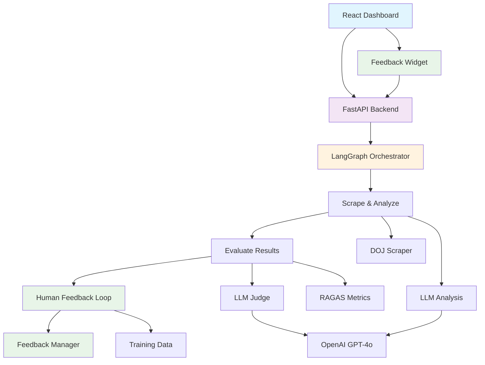

## Project Plan 

I want to use the file to write my project plan to use llm to help achieve each feature 

- 1. add llm platform to manage workflow: done, use langchain
- 2. Build LLM Judge as eval layer to improve accuracy
    - create evaluate.py to use ragas for quick evals result for accuracy
- 3. Build langgraph for agent that make llm call and output result
    - evaluate result w score
    - push score to langfuse
- 4. add react dashboard -  done 
    - Make to more explainable w one sentence intro on Top
    - Add CVS download button on result to local computer
    - add filter for Money laundering flag
- 5. Create architecture diagram using excaldraw
- 6. Edge case handling 
   - 6.1: exclude video format () https://www.justice.gov/news/videos) - **COMPLETED**
     - Enhanced video URL filtering with comprehensive patterns
     - Added video content filtering from page content
     - Added configuration option to enable/disable video filtering
     - Filters video platforms, file extensions, and video-related paths
- 7. LangGraph: add human in the loop feedback to help agent improve accuracy - **COMPLETED**
   - 7.1: Added feedback management system with FeedbackManager
   - 7.2: Integrated feedback node into LangGraph workflow
   - 7.3: Created React UI components for thumbs up/down feedback
   - 7.4: Added feedback statistics dashboard
   - 7.5: Implemented training data export functionality
- 8. Documentation
   - 8.1 add Langfuse portal(https://us.cloud.langfuse.com/project/cmdckuujh0bvnad07ptolsqrb/scores) in README.md - **COMPLETED**
     - Added Langfuse portal link to README.md
     - Updated architecture documentation with current system components
     - Added comprehensive features section highlighting all implemented functionality
     - Updated quickstart instructions for React dashboard and FastAPI backend

## Architecture Diagram (Mermaid)

    