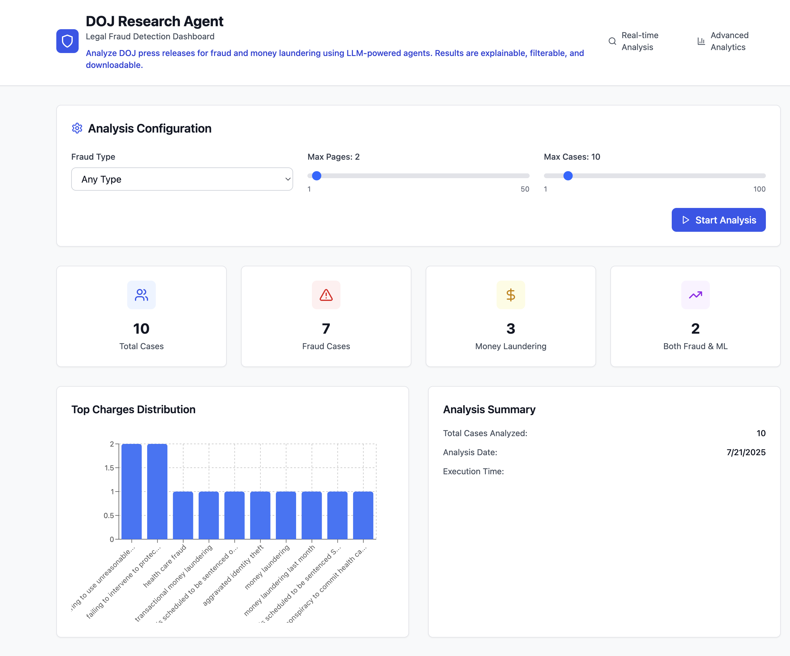

<div align="center">

# DOJ Multi-Agent Research System

[](https://doj-fraud-agent.netlify.app/) [](https://us.cloud.langfuse.com/project/cmdckuujh0bvnad07ptolsqrb/scores) [](LICENSE)

</div>

An intelligent multi-agent system for analyzing DOJ fraud cases with specialized agents for research, evaluation, and legal intelligence. Features coordinated workflows, real-time performance monitoring, and adaptive system behavior with React dashboard, FastAPI backend, and LangGraph orchestration.

---

## Documentation
📖 **[Documentation](https://doj-fraud-agent.netlify.app/)** • 🐳 **Docker** • 📊 **Langfuse Portal**

---

## Why?
The Association of Certified Fraud Examiners is the largest fraud fighting organization on the planet. In addition to providing a world-renowned certification, the ACFE also produces various research studies to support fraud examiners globally. These studies have primairly been based on surveys and responses from ACFE membership.

This tool is an effort to expand the research capabilities of the ACFE by examining active U.S. Department of Justice (and, hopefully in the future, other jurisdictions) fraud and money laundering investigations, indictments, and recent convictions. The ability to rapidly analyze DOJ activity can help fraud examiners stay on top of new fraud trends and see what law enforcement is working on to better inform referrals and tips.

---

## How it Works

### 🤖 **Multi-Agent Architecture**
- **🔍 Research Agent**: Specialized fraud detection and pattern analysis
- **📊 Evaluation Agent**: Performance monitoring and quality assessment
- **⚖️ Legal Intelligence Agent**: Legal precedent analysis and compliance validation
- **🎯 Meta-Agent**: Strategic oversight and dynamic coordination

### 🔄 **Coordination Strategies**
- **Sequential**: Controlled, step-by-step processing for complex cases
- **Parallel**: Concurrent execution for maximum efficiency
- **Adaptive**: Dynamic strategy switching based on real-time performance

### 🏗️ **System Components**
- **React Dashboard**: Modern, responsive web UI with real-time feedback
- **FastAPI Backend**: Handles scraping, analysis, and multi-agent coordination
- **LangGraph Orchestration**: Intelligent workflow management with agent communication
- **Langfuse Integration**: Comprehensive tracing and evaluation metrics
- **Docker Compose**: One command to run everything

## Quickstart

1. **Clone & Enter the Repo**
   ```bash
   git clone https://github.com/Alicelibinguo5/doj-fraud-agent.git
   cd doj-fraud-agent
   ```

2. **Run Full System with Docker Compose**
   ```bash
   docker compose build
   docker compose up
   ```
   - React Dashboard: [http://localhost:3000](http://localhost:3000)
   - FastAPI Backend: [http://localhost:8000](http://localhost:8000)
   - Langfuse Portal: [https://us.cloud.langfuse.com/project/cmdckuujh0bvnad07ptolsqrb/scores](https://us.cloud.langfuse.com/project/cmdckuujh0bvnad07ptolsqrb/scores)

3. **Quick Multi-Agent Demo** (Interview Ready)
   ```bash
   cd doj_research_clean
   python multi_agent_demo.py
   ```
   ✨ *Perfect for demonstrating multi-agent concepts in 2 minutes!*

4. **(Optional) Local Development**
   ```bash
   # Backend
   cd backend
   python -m uvicorn main:app --reload --port 8000
   
   # Frontend
   cd frontend/react-dashboard
   npm install
   npm start
   ```

---
## Architecture


### System Components

**🖥️ Frontend Layer:**
- **React Dashboard**: Multi-agent UI with real-time monitoring
- **Agent Monitor**: Performance metrics, logs, and communication tracking

**⚡ Backend Layer:**
- **FastAPI Server**: Multi-agent API and coordination endpoint
- **Redis Queue**: Task management and asynchronous processing

**🤖 Multi-Agent System:**
- **🔍 Research Agent**: Fraud detection and pattern analysis
- **📈 Evaluation Agent**: Performance monitoring and quality assessment
- **⚖️ Legal Agent**: Precedent analysis and compliance validation
- **🎯 Meta-Agent**: Strategic control and coordination optimization

**🔄 Coordination Engine:**
- **LangGraph Orchestrator**: Workflow management and agent coordination
- **Shared Memory**: Cross-agent state persistence and knowledge sharing
- **Message Queue**: Inter-agent communication and event handling

**🌐 External Services:**
- **DOJ Sources**: Legal data, cases, and regulatory information

**📊 Monitoring & Analytics:**
- **Langfuse Portal**: [Multi-agent tracing and performance analytics](https://us.cloud.langfuse.com/project/cmdckuujh0bvnad07ptolsqrb/scores)
  - Agent interaction visualization
  - Coordination strategy performance
  - System health monitoring

---
## Features

### 🤖 **Multi-Agent Intelligence**
- **Agent Specialization**: Each agent has single responsibility (research, evaluation, legal)
- **Inter-Agent Communication**: Message-based coordination and knowledge sharing
- **Adaptive Coordination**: Dynamic strategy switching (sequential → parallel → adaptive)
- **Performance Optimization**: Real-time metrics and system self-improvement
- **Fault Tolerance**: Graceful handling of agent failures without system crashes

### 🔍 **Intelligent Analysis**
- **Research Agent**: Automated DOJ scraping, fraud detection, and pattern analysis
- **Evaluation Agent**: Quality assessment, performance monitoring, and accuracy tracking
- **Legal Intelligence Agent**: Precedent matching, compliance validation, and risk assessment
- **Meta-Agent**: Strategic oversight, task allocation, and coordination optimization

### 📊 **Real-time Dashboard**
- Interactive React UI with multi-agent status monitoring
- Agent performance metrics and communication logs
- CSV export functionality with agent attribution
- Execution time tracking across coordination strategies

### 🤖 **Advanced Learning & Adaptation**
- **Shared Memory System**: Cross-agent knowledge persistence and learning
- **Dynamic Strategy Selection**: System adapts coordination based on performance
- **Human-in-the-Loop**: Thumbs up/down feedback integration across all agents
- **Continuous Improvement**: Agent behavior adapts based on feedback and performance

### 📈 **Comprehensive Monitoring**
- **Multi-Agent Tracing**: Langfuse integration for agent interaction visualization
- **Performance Analytics**: Strategy comparison and optimization insights
- **Quality Metrics**: Cross-agent validation and accuracy assessment
- **System Health**: Real-time monitoring of agent status and coordination efficiency

## Multi-Agent Demo Output
```bash
🎯 DOJ MULTI-AGENT RESEARCH SYSTEM
==================================

=============== SEQUENTIAL STRATEGY ===============
🔍 Research Agent analyzing: fraud-scheme-1
📨 research_agent → evaluation_agent: case_analyzed
📨 research_agent → legal_agent: fraud_case
✅ Research completed: 🚨 FRAUD (0.85)
⚖️  Legal Agent analyzing: fraud-scheme-1
📊 Evaluation Agent performing assessment...

📊 STRATEGY COMPARISON
Sequential | Time:  4.31s | Messages: 13 | Fraud: 60.0%
Parallel   | Time:  2.71s | Messages: 15 | Fraud: 60.0%
Adaptive   | Time:  3.31s | Messages: 12 | Fraud: 60.0%

🎉 Key Concepts Demonstrated:
   🤖 Agent Specialization & Single Responsibility
   🔄 Multiple Coordination Strategies
   📨 Inter-Agent Message Passing
```

## Example Dashboard 


*See the [Documentation](https://doj-fraud-agent.netlify.app/) for detailed screenshots and usage examples.*

## Getting Started

### 🚀 **Quick Demo** (Perfect for Interviews)
```bash
cd doj_research_clean
python multi_agent_demo.py
```
*Demonstrates all multi-agent concepts in under 2 minutes!*

### 🏗️ **Full System** (Production Ready)
```bash
docker compose up
# Access React Dashboard at http://localhost:3000
```

### 📚 **Learning Path**
1. **Start with Demo**: Run `multi_agent_demo.py` to understand concepts
2. **Explore Architecture**: Review agent implementations in `doj_research_agent/agents/`
3. **Try Full System**: Use Docker Compose for complete experience
4. **Customize Agents**: Extend base agent classes for new capabilities

## Need Help?
- **Quick Start**: Run the multi-agent demo for immediate understanding
- **System Monitoring**: Check [Langfuse Portal](https://us.cloud.langfuse.com/project/cmdckuujh0bvnad07ptolsqrb/scores) for agent performance
- **Development**: Use `docker compose logs` for debugging agent interactions
- **Community**: Open an issue or PR—multi-agent feedback welcome!

---

## License
MIT. See [LICENSE](LICENSE).
