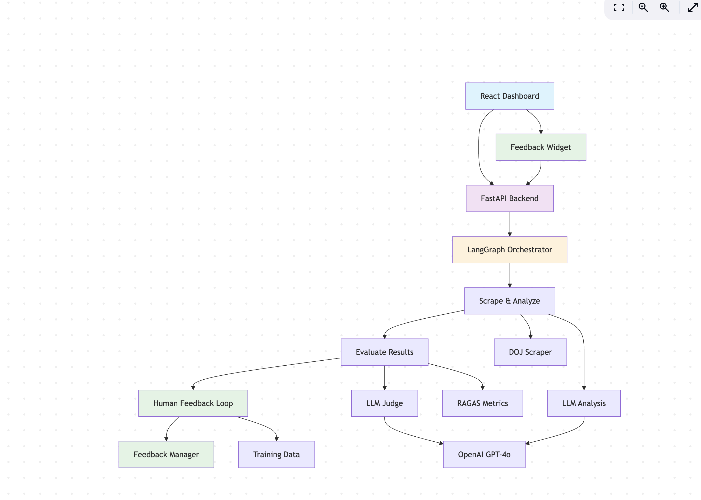
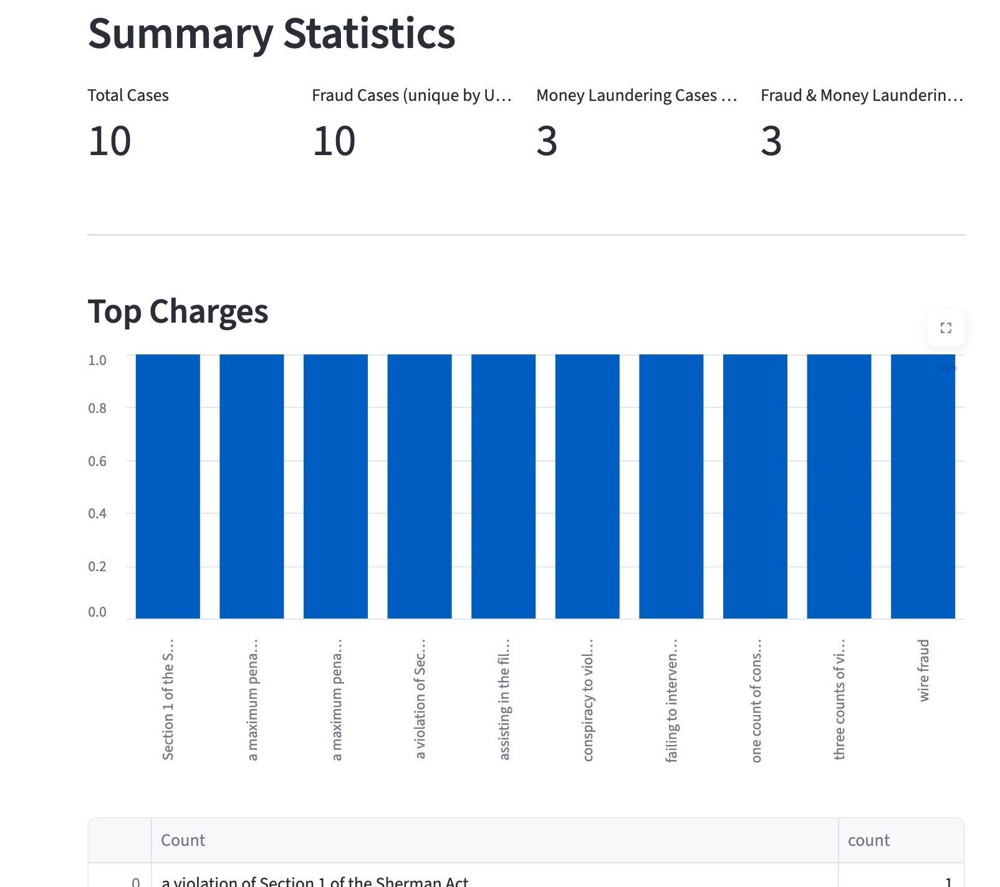

<div align="center">

# DOJ Legal Fraud Research Agent

[](LICENSE)

</div>

A friendly, end-to-end tool for exploring and categorizing DOJ press releases, with a focus on fraud detection. Includes a dashboard, API, and CLI for legal research and data analysis.

---

## Why?
The Association of Certified Fraud Examiners is the largest fraud fighting organization on the planet. In addition to providing a world-renowned certification, the ACFE also produces various research studies to support fraud examiners globally. These studies have primairly been based on surveys and responses from ACFE membership.

This tool is an effort to expand the research capabilities of the ACFE by examining active U.S. Department of Justice (and, hopefully in the future, other jurisdictions) fraud and money laundering investigations, indictments, and recent convictions. The ability to rapidly analyze DOJ activity can help fraud examiners stay on top of new fraud trends and see what law enforcement is working on to better inform referrals and tips.

---

## How it Works

- **Streamlit Dashboard**: User-friendly web UI
- **FastAPI Backend**: Handles scraping, analysis, and GPT-4o fraud detection
- **Docker Compose**: One command to run everything

---
## Architect



## Quickstart

1. **Clone & Enter the Repo**
   ```bash
   git clone https://github.com/Alicelibinguo5/doj-legal-research-agent.git
   ```
2. **Run with Docker Compose**
   ```bash
   docker compose build
   docker compose up
   ```
   - Dashboard: [http://localhost:8501](http://localhost:8501)
   - API: [http://localhost:8000](http://localhost:8000)

3. **(Optional) Local Dev**
   ```bash
   poetry install
   poetry shell
   streamlit run app/streamlit_agent.py
   ```

---
## Example Dashboard 


## Need Help?
- Check the dashboard for tips
- Use `docker compose logs` for debugging
- Open an issue or PR—feedback welcome!

---

## License
MIT. See [LICENSE](LICENSE).
